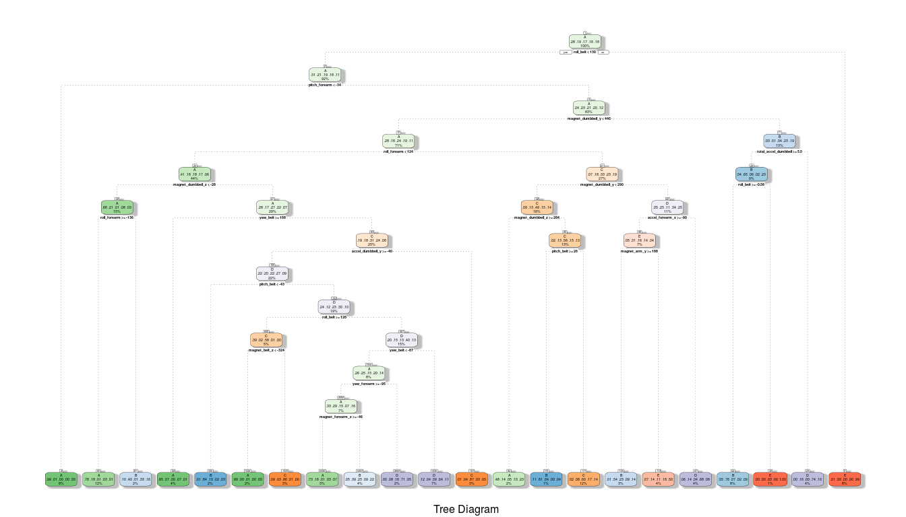

Coursera MOCC PML Final Project
================
T. Ruzmetov
December 28, 2016

Executive Summary
-----------------

By using data from accelerometers of 6 participants the goal of the project is to predict the manner in which exercise was done. First, some data cleansing is performed by getting rid of unnecessary variables such as user name and row index... Second, number of covariates are reduced by eliminating those with high fraction of "NA's" and those with near zero variance. Third, given training set is split into sub training and validation sets in order to evaluate and improve the performance of prediction. Models are built using "Decision Trees" and "Random Forest" algorithms.

Personal Activity Data
----------------------

Using devices such as Jawbone Up, Nike FuelBand, and Fitbit it is now possible to collect a large amount of data about personal activity relatively inexpensively. These type of devices are part of the quantified self movement – a group of enthusiasts who take measurements about themselves regularly to improve their health, to find patterns in their behavior, or because they are tech geeks. One thing that people regularly do is quantify how much of a particular activity they do, but they rarely quantify how well they do it. In this project, your goal will be to use data from accelerometers on the belt, forearm, arm, and dumbell of 6 participants. They were asked to perform barbell lifts correctly and incorrectly in 5 different ways. More information is available from the website here: <http://groupware.les.inf.puc-rio.br/har> (see the section on the Weight Lifting Exercise Dataset).

``` r
library(knitr); library(ggplot2) 
library(caret); library(rpart); library(rpart.plot)
```

    ## Loading required package: lattice

``` r
library(RColorBrewer); library(rattle);library(randomForest)
```

    ## Rattle: A free graphical interface for data mining with R.
    ## Version 4.1.0 Copyright (c) 2006-2015 Togaware Pty Ltd.
    ## Type 'rattle()' to shake, rattle, and roll your data.

    ## randomForest 4.6-12

    ## Type rfNews() to see new features/changes/bug fixes.

    ## 
    ## Attaching package: 'randomForest'

    ## The following object is masked from 'package:ggplot2':
    ## 
    ##     margin

``` r
test_set <- read.csv("data/pml-testing.csv",na.strings=c("NA","", "#DIV/0!"))
train_set <- read.csv("data/pml-training.csv", na.strings=c("NA","", "#DIV/0!"))
set.seed(1001)
```

Data Cleaning
-------------

1.  Removing first 7 columns and features with near zero variability.

``` r
train_set <- train_set[c(-1,-2,-3,-4,-5,-6,-7)]
nzv_train <- nearZeroVar(train_set, saveMetrics=TRUE, allowParallel = TRUE)
new_names <- rownames(nzv_train[nzv_train$nzv == FALSE,])
data_train <- train_set[new_names]
```

1.  Getting rid of columns with high fraction of missing values.

``` r
row_size <- nrow(data_train)
#eliminating features which contain more than 80% NA's
data_train <- data_train[as.numeric(colSums(is.na(data_train)))/row_size < 0.8]
#now we make sure that test set has same features as train set
new_names <- names(data_train)
tmp_names <- new_names[1:length(new_names)-1]
data_test <- test_set[tmp_names]
dim(data_train); dim(data_test)
```

    ## [1] 19622    53

    ## [1] 20 52

Cross Validation
----------------

Here I splite provided training data into sub training(70%) and validation(30%) sets.

``` r
train_indx <- createDataPartition(y=data_train$classe, p=0.7, list=FALSE)
Training <- data_train[train_indx, ]; CrossVal <- data_train[-train_indx, ]
```

ML: Decision Trees
------------------

``` r
#building a model with trees
model_trees <- rpart(classe ~ ., data=Training, method="class")
fancyRpartPlot(model_trees, sub="Tree Diagram")
```



``` r
#predicting
prediction_trees <- predict(model_trees, CrossVal, type = "class")
confusionMatrix(prediction_trees, CrossVal$classe)
```

    ## Confusion Matrix and Statistics
    ## 
    ##           Reference
    ## Prediction    A    B    C    D    E
    ##          A 1493  196   21   54   48
    ##          B   69  740  141   91  132
    ##          C   28   79  761  136   94
    ##          D   55   89   73  643  110
    ##          E   29   35   30   40  698
    ## 
    ## Overall Statistics
    ##                                           
    ##                Accuracy : 0.7366          
    ##                  95% CI : (0.7252, 0.7478)
    ##     No Information Rate : 0.2845          
    ##     P-Value [Acc > NIR] : < 2.2e-16       
    ##                                           
    ##                   Kappa : 0.6659          
    ##  Mcnemar's Test P-Value : < 2.2e-16       
    ## 
    ## Statistics by Class:
    ## 
    ##                      Class: A Class: B Class: C Class: D Class: E
    ## Sensitivity            0.8919   0.6497   0.7417   0.6670   0.6451
    ## Specificity            0.9242   0.9088   0.9306   0.9336   0.9721
    ## Pos Pred Value         0.8240   0.6309   0.6931   0.6629   0.8389
    ## Neg Pred Value         0.9556   0.9153   0.9446   0.9347   0.9240
    ## Prevalence             0.2845   0.1935   0.1743   0.1638   0.1839
    ## Detection Rate         0.2537   0.1257   0.1293   0.1093   0.1186
    ## Detection Prevalence   0.3079   0.1993   0.1866   0.1648   0.1414
    ## Balanced Accuracy      0.9081   0.7792   0.8362   0.8003   0.8086

ML: Random Forest
-----------------

``` r
model_rf <- randomForest(classe ~. , data=Training)
prediction_rf <- predict(model_rf, CrossVal, type = "class")
confusionMatrix(prediction_rf, CrossVal$classe)
```

    ## Confusion Matrix and Statistics
    ## 
    ##           Reference
    ## Prediction    A    B    C    D    E
    ##          A 1674    5    0    0    0
    ##          B    0 1132   11    0    0
    ##          C    0    2 1014    7    0
    ##          D    0    0    1  957    3
    ##          E    0    0    0    0 1079
    ## 
    ## Overall Statistics
    ##                                           
    ##                Accuracy : 0.9951          
    ##                  95% CI : (0.9929, 0.9967)
    ##     No Information Rate : 0.2845          
    ##     P-Value [Acc > NIR] : < 2.2e-16       
    ##                                           
    ##                   Kappa : 0.9938          
    ##  Mcnemar's Test P-Value : NA              
    ## 
    ## Statistics by Class:
    ## 
    ##                      Class: A Class: B Class: C Class: D Class: E
    ## Sensitivity            1.0000   0.9939   0.9883   0.9927   0.9972
    ## Specificity            0.9988   0.9977   0.9981   0.9992   1.0000
    ## Pos Pred Value         0.9970   0.9904   0.9912   0.9958   1.0000
    ## Neg Pred Value         1.0000   0.9985   0.9975   0.9986   0.9994
    ## Prevalence             0.2845   0.1935   0.1743   0.1638   0.1839
    ## Detection Rate         0.2845   0.1924   0.1723   0.1626   0.1833
    ## Detection Prevalence   0.2853   0.1942   0.1738   0.1633   0.1833
    ## Balanced Accuracy      0.9994   0.9958   0.9932   0.9960   0.9986

``` r
#Here is the little trick to make sure that factor variables in
#the training and test data have same levels. Turns out that "RandomForest"
#method is very sensetive to such a difference.
data_test <- rbind(Training[1, -length(Training)] , data_test)
data_test <- data_test[-1,]

prediction_trees_test <- predict(model_trees, data_test, type = "class")
prediction_rf_test <- predict(model_rf, data_test, type = "class")

prediction_trees_test
```

    ## 22  3  4  5  6  7  8  9 10 11 12 13 14 15 16 17 18 19 20 21 
    ##  B  A  B  D  A  C  D  A  A  A  C  B  A  A  E  D  A  B  B  B 
    ## Levels: A B C D E

``` r
prediction_rf_test 
```

    ## 22  3  4  5  6  7  8  9 10 11 12 13 14 15 16 17 18 19 20 21 
    ##  B  A  B  A  A  E  D  B  A  A  B  C  B  A  E  E  A  B  B  B 
    ## Levels: A B C D E

Using 30% of given training set calculated out of sample error is:

1.  Decision Trees model: err = 0.36

2.  Random Forest model: err = 0.005

Conclusion
----------

By performing a classification into five different classes on weight lifting activity data using two machine learning methods such as "Decision Trees" and "Random Forest" it's been shown that both models are robust given carefully selected features, but the latter one is much more accurate in prediction and somewhat slower in performance.
